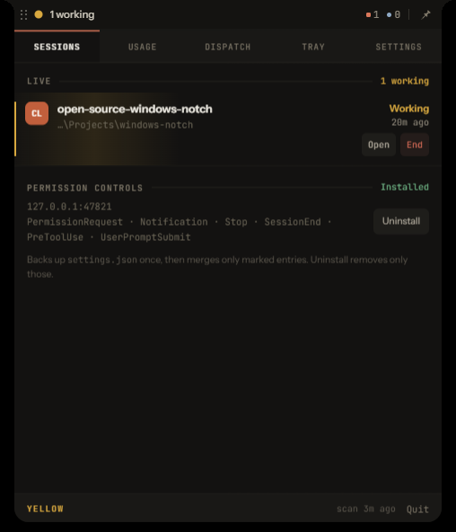

# Windows Notch

**A faux MacBook notch for Windows that tells you what your coding agents are doing.**

An always-on-top status indicator for Claude Code, Codex, and Claude Design. The collapsed pill
shows live agent counts; hovering expands it into sessions, permission controls, usage, dispatch, a
file tray, and settings. It answers permission prompts without you switching windows, and it never
appears in the taskbar or Alt-Tab.

<p align="center">
  
</p>

## Install

```powershell
git clone https://github.com/osaini/windows-notch.git
cd windows-notch
npm install
npm run icons
npm run dist
```

Run the installer from `release\`, then press **Win**, type **notch**, Enter. Windows 10/11 and
Node 22+ are required; see [Requirements](#requirements) for the agent CLIs.

The installer is unsigned, so SmartScreen shows "Windows protected your PC" the first time —
**More info** → **Run anyway**. If you would rather run from source, see
[CONTRIBUTING.md](CONTRIBUTING.md).

## Security

This app launches coding agents on your machine, so please read
**[SECURITY.md](SECURITY.md)** before installing. The short version:

- **Dispatch can bypass approval prompts.** That is the point of the feature, and it means anything
  driving the overlay can run code as you.
- **Permission controls edit `~/.claude/settings.json`.** A pristine backup is written first, and
  uninstalling restores it.
- **The phone companion is off by default.** Turning it on starts a plain-HTTP server on every
  network interface, and a paired phone can run agents in your projects unattended. Only enable it
  on a network you trust, and never port-forward it.
- **No telemetry.** The only host the app contacts is `api.anthropic.com`, for your usage figures.

## Status colors

- green — idle
- yellow — working
- red — waiting for you
- blue — Claude review gate
- grey — no active or recent sessions

The aggregate priority is red > blue > yellow > green.

## Requirements

- Windows 10/11
- Node.js 22+
- Claude Code — tested against 2.1.220
- Codex is optional — tested with Codex Desktop and `codex-cli 0.130.0-alpha.5`
- Claude Design is optional — tested with Claude Desktop 1.24012.9 (MSIX)
- Windows Terminal is preferred for dispatch; a safely encoded PowerShell console is the fallback

Claude and Codex session/transcript formats are undocumented internals and can change between
versions.

## Running from source

If you are developing rather than installing, the Start menu shortcut is the easiest everyday
launch:

```powershell
npm install
npm run build
npm run launcher:install
```

Then press **Win**, type **notch**, and hit Enter. The shortcut runs this repo's Electron binary
against the built `out/` bundle, so after changing source you only re-run `npm run build` — the
shortcut picks it up with no reinstall. Launching again while it is already running expands the
panel for a moment so you can see it is alive.

`npm run launcher:uninstall` removes the shortcut.

For development:

```powershell
npm install
npm run dev
```

For the production bundle:

```powershell
npm run package
```

Then open:

```text
release\win-unpacked\Windows Notch.exe
```

To build the installer:

```powershell
npm run dist
```

The installer creates Start menu and desktop shortcuts named **Notch**. Settings also has a
**Launch at Windows sign-in** toggle. Choosing Quit fully exits the app; reopen it from either
shortcut, or double-click the unpacked executable.

This repository produces unsigned Windows binaries. A managed Windows Application Control policy
may block a newly rebuilt portable executable by hash. `npm start` uses Electron's development
runtime and remains the local fallback; signing is required for general distribution.

Other commands:

```powershell
npm run typecheck
npm run build
npm run hooks:install
npm run hooks:uninstall
npm run launcher:install
npm run launcher:uninstall
npm run verify              # exercises the real ~/.claude — see CONTRIBUTING.md
```

The overlay does not appear in the taskbar or Alt-Tab. Quit from its footer or tray icon.

## Sessions and states

### Claude

`~/.claude/sessions/<pid>.json` is watched with `fs.watch` plus a two-second safety poll. Session
files can outlive their process, so liveness is verified with `process.kill(pid, 0)`:

- `ESRCH` means dead
- `EPERM` still means alive, but owned by another/elevated process

Plain terminal Claude sessions do not always write these files in Claude Code 2.1.220. App-managed
sessions and background jobs do; terminal-only sessions can therefore remain invisible.

`Stop` received while the session file remains `busy` becomes the blue `reviewing` state. It clears
when the file changes to idle.

### Codex

Codex sessions come from:

```text
~/.codex/sessions/YYYY/MM/DD/rollout-*.jsonl
~/.codex/session_index.jsonl
```

Codex does not associate rollouts with a PID. State is therefore derived from its explicit rollout
lifecycle:

- unmatched `task_started` → working
- `task_complete` → idle
- an outstanding user-input tool call → waiting for you

Active threads remain visible. Completed threads age out after 30 minutes. This avoids treating all
historical rollout files as live while preserving a useful recent-session list.

Session labels use Codex Desktop's `thread_name` from `session_index.jsonl`, keyed by rollout UUID.
If no indexed title is available yet, the watcher falls back to transcript metadata, the first real
user prompt, and finally the project directory name. Index titles are reapplied every scan, so a
Desktop rename appears without requiring the rollout file itself to change.

Codex Desktop and long-lived app-server processes do not expose a per-thread process to terminate.
The Codex row therefore says **Hide**, preserves the transcript, and reports that limitation.

#### Codex questions require an upstream feature flag

Answerable Codex question cards depend on Codex offering the `request_user_input` tool to the model.
That is gated behind a Codex feature flag which ships **off**:

```
codex features list | grep request_user_input
#   default_mode_request_user_input      under development  false

codex features enable default_mode_request_user_input
```

With the flag off, Codex never asks, so nothing reaches the notch — this is not a Notch bug, and no
amount of Notch-side change will surface a question that was never asked. Notch's handler already
matches the current `ToolRequestUserInputParams` schema exactly (verify with
`codex app-server generate-json-schema`).

The flag is marked *under development* upstream and may behave unpredictably. Questions from Codex
sessions started **outside** Notch remain view-only regardless, because only the dispatching client
holds the app-server request needed to answer them.

### Claude Design

Claude Design runs against claude.ai and writes nothing to disk — no session file, no transcript, no
local state beyond a window-geometry file. So unlike Claude Code and Codex, there is nothing to read.
It is detected from its **window** instead.

Claude Desktop opens Design from the sidebar as its own Electron `BrowserWindow` and pins that
window's caption: the design window installs `page-title-updated -> preventDefault()`, so the caption
stays the creation-time title for as long as the window lives. A design window is therefore any
window that is all of:

- owned by a process named `claude.exe`
- of window class `Chrome_WidgetWin_1` (every Electron top-level window; excludes the hidden
  IME/DDE helper windows the same process owns)
- visible, with a caption of exactly `Design` or `Claude Design`

The main Claude window is not matched, because its caption follows the page it is showing. Every
locale shipped with Claude Desktop 1.24012.9 uses the same `Design` string.

Enumeration runs in one long-lived `powershell.exe` helper that sweeps every three seconds and prints
one JSON line per sweep — re-spawning PowerShell on each sweep would cost more than everything else
the notch does. If the helper cannot be kept alive, the Sessions tab says so and design rows
disappear rather than going stale.

**What this can and cannot tell you.** Presence is the entire signal. An open design window is
reported `idle` with the raw status `window-open`, and the row reads **Open**, not *Idle* — the notch
has no way to know whether Design is mid-generation. It contributes green, never yellow or red.

Concurrent design windows each get their own row, ordered by window handle and numbered. **Focus**
targets that exact `HWND`, which makes it the one focus path in the app that is not best-effort.
Every design window shares one process with Claude Desktop, so there is nothing safe to terminate:
the row says **Hide**, and it only hides the row.

## Permission controls

The hook server binds to `127.0.0.1:47821`, walking forward if necessary. Hook installation is
manual and reversible:

- a pristine `settings.json.windows-notch-backup` is created once
- installation merges only marked Windows Notch entries
- uninstall removes only those marked entries
- writes use a temporary file and rename

`PermissionRequest` is held so the panel can show the real tool name and input. The response schema
is Claude's documented shape:

```json
{
  "hookSpecificOutput": {
    "hookEventName": "PermissionRequest",
    "decision": { "behavior": "allow" }
  }
}
```

The user can Allow once or Deny. A self-imposed 30-second deadline returns an empty successful JSON
response, handing the prompt back to Claude's normal terminal UI. The installed hook timeout is 45
seconds, leaving a safety margin so an unattended notch cannot wedge the session.

Notification, Stop, and SessionEnd hooks remain non-blocking.

## Usage

The scanner incrementally reads:

```text
~/.claude/projects/**/*.jsonl
~/.codex/sessions/**/*.jsonl
```

Per-file offsets and aggregates are cached in `app.getPath('userData')/usage-cache.json`. Reads use
4 MB byte slices, keep incomplete trailing lines for the next pass, and do not split UTF-8
characters. Claude retry deduplication persists `message.id + requestId` keys across scans.

Codex's cumulative `token_count` events are converted into per-event deltas. Combined output
includes totals, request/session counts, streaks, peak hour, model breakdowns, a 182-day heatmap,
and rolling five-hour local activity.

Real plan utilization is shown separately:

- Claude: `~/.claude.json.cachedUsageUtilization`
- Codex: the latest rollout `rate_limits` payload

Both show reset times, fetch age, and a stale marker after 15 minutes. The local five-hour activity
meter is not presented as a plan percentage.

## Dispatch

Choose Claude Code or Codex, a recent project, prompt, and agent-specific permission/approval mode.
The project control includes a native **Browse…** button, so any local directory can be selected
through Windows File Explorer. A browsed directory is added to the current recent-project list.

Primary launcher:

```text
wt.exe -d <cwd> -- <claude|codex> <args...>
```

The `--` terminator is required. Arguments are passed as an array, so Windows Terminal does not
interpret prompt punctuation as pane syntax.

When Windows Terminal is absent, the app opens a new PowerShell console. Every user-controlled
value is base64-decoded inside a fixed script and invoked as an argument array; no prompt text is
interpolated into shell syntax.

The Tray holds dropped file paths and appends them to the next dispatch as references. Files are not
copied or uploaded.

## Session actions

- **Focus** walks Claude's process ancestors to the first visible host window and calls
  `SetForegroundWindow`. Windows Terminal exposes a window, not a stable public tab API, so the
  exact tab remains best-effort.
- Codex Focus selects the Codex Desktop window, with the newest Windows Terminal window as fallback.
- Claude Design Focus foregrounds the recorded `HWND` directly — no ancestor walk, no guessing.
- **End** asks for confirmation, terminates a Claude PID, verifies that it died, then suppresses the
  row. `EPERM` is reported honestly. Only Claude Code rows can be ended; a design row's PID is
  Claude Desktop itself.
- **Hide** removes a Codex row without deleting its transcript, or a Claude Design row without
  touching the window.

## Position and behavior

Settings persists:

- monitor
- top, bottom, left, or right screen edge
- normalized offset along that edge
- common position presets
- launch-at-login preference

Drag the pill to move between monitors and edges. The panel closes for the duration and the pill
follows the cursor directly, smoothed by an exponential follow in the main process rather than by
per-edge bounds animations.

- Sliding along an edge keeps the pill flush against it and magnetises it to nearby presets.
- Pulling away opens an elastic gap and rounds the outer corners progressively; past `100px` the
  pill separates and flies free as a fully rounded rectangle under the cursor.
- Coming back within `64px` reattaches it, and the corners square off again.
- A hold stays on the axis it started on. Only the release picks a perpendicular edge, and the pill
  turns onto its side during the flight there.
- Releasing mid-air settles onto the nearest edge; releasing while still attached leaves it on the
  edge it is held against, so sliding into a corner cannot fling it onto the other one.

Native bounds still animate when a saved position changes from Settings.

The transparent `520×660` BrowserWindow stays fixed-size. The renderer expands inside it, avoiding
native resize flicker. While collapsed it is truly click-through. A main-process cursor poll detects
the pill in screen coordinates and asks the renderer to expand; this does not depend on Windows
forwarding hover events through a click-through Chromium window.

Exclusive-fullscreen apps may cover the overlay.

## Phone companion

**Off by default.** Enable it under Settings → Phone companion → **Allow phone access**. Read
[SECURITY.md](SECURITY.md) first: this is the largest attack surface in the app, and pairing a
device grants it unattended code execution in your projects.

Once enabled, Windows Notch hosts a mobile web app and authenticated API on port `47822`, bound to
every network interface. Copy one of the phone companion URLs to a phone on the same private
network and enter the displayed six-digit pairing code. Windows Firewall may ask you to allow the
app on private networks. Turning the setting back off closes the port immediately, without a
restart.

The phone receives live session snapshots over server-sent events, reads normalized recent
transcript messages, launches Claude or Codex in a project the *computer* already knows about
(the phone cannot name an arbitrary directory), and can send a follow-up to an idle resumable
session.

Those follow-ups run **without approval prompts** — Claude with `dontAsk`, Codex with
`workspace-write` and `approval_policy="never"`. The computer still decides *which* directories are
reachable, but within them the phone is trusted. Treat a paired phone as equivalent to a terminal
on the machine.

Pairing codes expire after ten minutes and are rate limited to 8 attempts per IP per five minutes
and 24 attempts in total per issued code. Device tokens are 32 random bytes, stored SHA-256 hashed,
expire after 30 days, and can be revoked at any time with **Unpair all phones**.

The transport is plain HTTP, so the device token crosses your network in cleartext on every
request. Use it only on a trusted private LAN or private overlay network — never by forwarding the
port to the public internet. The included PWA manifest is ready, but service-worker installation
and offline caching on a phone require HTTPS.

## Layout

```text
src/
  main/
    index.ts            lifecycle, IPC composition and payload validation
    windows.ts          overlay, positioning, dragging and native hover detection
    settings.ts         persisted application settings
    sessionWatcher.ts   Claude PID sessions + Codex rollout state + Claude Design windows
    designWatcher.ts    long-lived PowerShell sweep for Claude Design windows
    hookServer.ts       HTTP hooks and pending permission decisions
    hookInstaller.ts    reversible Claude settings merge
    usage.ts            incremental Claude + Codex usage and plan caches
    dispatcher.ts       safe Claude/Codex terminal launch
    comboPrompts.ts     implementer/reviewer role prompts for claude-codex pairs
    managedCodex.ts     Codex app-server over a loopback WebSocket
    mobileBridge.ts     paired phone API, SSE, transcripts and static PWA host
    transcriptTail.ts   extracts a turn's closing question from a transcript
    agentVersions.ts    probes the installed agent CLI versions
    focus.ts            best-effort Windows host-window focus
    tray.ts             status tray icon and menu
  preload/index.ts      context-isolated renderer API
  renderer/
    App.tsx             shell, tab router and expand logic
    statusFlash.ts      status-change flash priority state machine
    format.ts           duration and path formatting
    emptyUsage.ts       empty-state usage snapshot
    components/Listbox.tsx
    tabs/
      Sessions.tsx      session rows and the interaction takeover
      Usage.tsx
      Dispatch.tsx
      Tray.tsx          file tray and drop target
      Settings.tsx
  shared/types.ts       every cross-boundary type
scripts/                verify, hook/launcher install, tests, icon generation
mobile/                 installable React phone companion (separate package)
debug-orchestrator/     adversarial Claude+Codex bug-discovery pipeline
docs/                   design notes
```

## Deliberately not included

- Voice dictation
- Transcript/PID heuristics for otherwise invisible plain Claude terminal sessions
- The requested Claude-product visual redesign
- Guaranteed focus of a specific Windows Terminal tab
- Forced termination of an individual Codex Desktop thread without a per-thread PID
- Busy/idle, project names, or usage for Claude Design — it is a claude.ai surface with no local
  state, so window presence is all the notch can honestly report
- Closing or terminating a Claude Design window, which shares one process with Claude Desktop

## Contributing

See [CONTRIBUTING.md](CONTRIBUTING.md) for the development loop, the check suite, and the two
Windows packaging quirks that look like bugs and are not. Security issues go through
[SECURITY.md](SECURITY.md), not the public issue tracker.

## License

[MIT](LICENSE) © Oaj Saini
